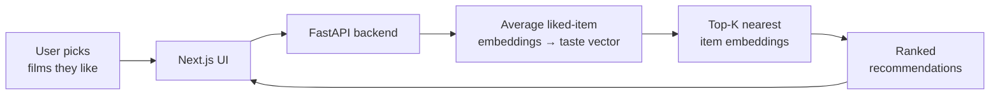

# CineMatch

**A movie recommender built on MovieLens-25M — from an honest baseline to a two-tower retrieval model, served as a full-stack app.**

Pick a few films you love; CineMatch builds a taste vector from them and returns the closest films you haven't seen. The recommendations come from embeddings learned by a two-tower retrieval model, served through a FastAPI backend and a Next.js frontend.

---

## What makes this project

Most recommender demos report one model's score in isolation. This one is built the honest way: **every model is measured against a simple baseline on a leakage-free split**, and each improvement is justified by what it fixes.

Three approaches were implemented and compared, and two real training failures were diagnosed and fixed along the way.

## Results

All models evaluated with **Recall@10** and **NDCG@10** on a **temporal split** (each user's most recent interactions held out for test — so the model is judged on predicting the future from the past, never on leaked data).

| Model | Recall@10 | NDCG@10 | vs. baseline |
|---|---|---|---|
| Popularity baseline | 0.0700 | 0.0632 | — |
| Matrix factorization (BPR) | 0.0825 | 0.0743 | +18% |
| **Two-tower + logQ correction** | **0.1286** | **0.1095** | **+84%** |

The two-tower model beats matrix factorization by **56%** on Recall@10.

## Architecture

**Training pipeline** — how the models were built and evaluated:

```mermaid
flowchart LR
    A[MovieLens-25M<br/>25M ratings] --> B[Temporal split<br/>no leakage]
    B --> C[Popularity<br/>baseline]
    C --> D[Matrix<br/>factorization]
    D --> E[Two-tower<br/>+ logQ]
    E --> F[Recall@10 /<br/>NDCG@10]
```

**Serving pipeline** — how a recommendation is produced at request time:



## How it was built (and what broke)

**Baseline first.** A popularity recommender (recommend the most-liked films to everyone) sets the bar at Recall@10 = 0.070. Any learned model has to beat this to justify its complexity.

**Matrix factorization — and a training collapse.** The first attempt *underperformed* the baseline. The loss curve flatlined after two epochs — a sign of too high a learning rate plus too-easy negatives. Lowering the learning rate and sampling multiple negatives per positive produced a healthy curve and an 18% lift over the baseline.

**Two-tower — and a popularity-bias failure.** A two-tower retrieval model (separate user and item encoders, the item tower using genre features) *initially scored below the baseline*. The cause: in-batch-softmax training was over-penalizing popular items, because popular films appear as negatives for many users in a batch — but popular films are often genuinely good recommendations. The fix was **logQ correction** (subtracting log-popularity from the logits, the sampling-bias correction from Google's two-tower retrieval work), which lifted Recall@10 from below baseline to 0.129 — an 84% improvement over the baseline and 56% over matrix factorization.

## Serving

The app recommends for **any user, with no cold-start**: a visitor picks a few films they like, the backend averages those films' learned embeddings into a taste vector, and returns the nearest items by cosine similarity. No per-user model is needed at serving time — the same trick real "tell us what you like" onboarding flows use.

- **Backend** — FastAPI. Loads the trained item embeddings once; endpoints for search, health, and recommend.
- **Frontend** — Next.js. Search films, add the ones you like, get ranked recommendations with a match score.

## Tech stack

Python, PyTorch, NumPy, pandas, FastAPI, Next.js, React, TypeScript.

## Running locally

**Backend**
```
cd backend
pip install -r requirements.txt
uvicorn main:app --reload
```
Runs on `http://127.0.0.1:8000` (interactive docs at `/docs`). Requires the trained
artifacts `item_embeddings.npy` and `model_meta.json` in `backend/model/` (produced by
the Stage 3 notebook's export cell).

**Frontend**
```
cd frontend
npm install
npm run dev
```
Runs on `http://localhost:3000`.

## Training

The models are trained in notebooks (`notebooks/`), stage by stage:
1. Data + temporal split + popularity baseline
2. Matrix factorization (BPR)
3. Two-tower retrieval + logQ correction, then export of the serving artifacts

Dataset: [MovieLens-25M](https://grouplens.org/datasets/movielens/25m/) (25M ratings; ratings ≥ 4 treated as positive implicit feedback).

## Scope & future work

CineMatch recommends within the **MovieLens-25M catalog (~20K mostly-Western films)**. Because item embeddings are learned from ratings, a film outside the training catalog has no embedding yet — the standard **item cold-start** problem. Two natural extensions:

- **A content-based item tower** (genres, cast, synopsis, poster features) would let new or unseen films — including non-Western cinema such as Bollywood — be embedded from their features without prior ratings.
- **A re-ranking stage** on top of retrieval (retrieve candidates with the two-tower model, then reorder with a ranker on richer features) — the standard production two-stage architecture.

## Notes

For learning and demonstration. Not a production recommender.
